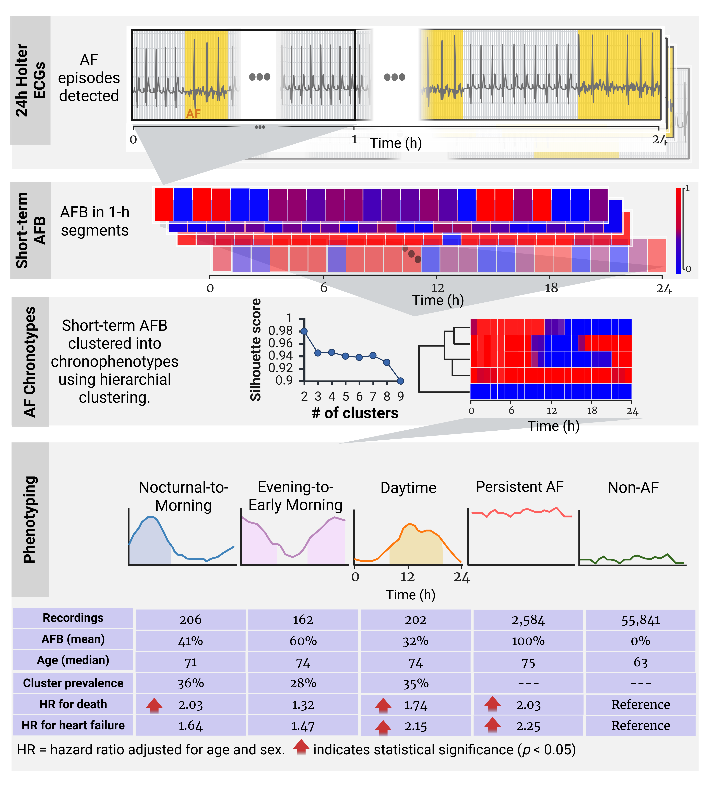

# Temporal Phenotyping of Paroxysmal Atrial Fibrillation Reveals Prognostic Circadian Subtypes

A data-driven framework for identifying **chronophenotypes** based on short-term temporal burden patterns from 24-hour Holter ECG recordings.

This approach uses hierarchical clustering of short-term AF burden (AFB) to reveal distinct circadian subtypes with unique clinical profiles and outcomes. Our findings suggest that **circadian manifestation patterns carry prognostic relevance**.

> **Note:** While developed for AF chronophenotyping, this framework generalizes to any time series data with known time-of-day information.

For more details and citation, see: *Brimer Biton et al., "Temporal Phenotyping of Paroxysmal Atrial Fibrillation Reveals Prognostic Circadian Subtypes," Machine Learning: Health (2026).*

---

## Overview

The original analysis pipeline consists of three stages:
1. ECG processing and AF detection
2. **Circadian characterization via clustering of short-term AFB** ← *this repository*
3. Statistical analysis for demographic/clinical characterization and outcomes

<p align="center">
  
</p>

*Figure: Chronophenotyping AF using 24-hour Holter recordings.*

---

## Two Workflows

| Workflow | Purpose | Output |
|----------|---------|--------|
| **Clustering** | Discover chronophenotypes from scratch | `chronophenotypes.csv` + dendrogram |
| **Prediction** | Classify new patients into known chronophenotypes | Predicted labels + confidence |

---

## Key Concepts

- **Burden Profiles**: For each patient, we compute the fraction of AF in each of the 24 hourly bins. This 24-dimensional vector represents their circadian AF pattern.
- **Chronophenotypes**: The output file containing burden profiles + cluster assignments for each patient.

### Chronophenotype Names (from Paper)

When using the provided `chronophenotypes.csv`, the cluster IDs correspond to:

| Cluster | Name | Description |
|---------|------|-------------|
| 0 | Nocturnal-to-Morning | AF burden peaks during night/early morning (12AM-10AM) |
| 1 | Evening-to-Early Morning | AF burden from evening through early morning (3PM-4AM) |
| 2 | Daytime | AF burden primarily during daytime hours (9AM-7PM) |
| 3 | Persistent AF | High AF burden throughout the day |
| 4 | Non-AF | Low/minimal AF burden |

To use these names in visualizations, set `use_paper_style=True`:

```python
plots.plot_tsne(burden_profiles, labels, use_paper_style=True)
plots.plot_chronophenotypes_combined(burden_profiles, labels, use_paper_style=True)
```

---

## Directory Structure

```
phenotyping-af/
├── run_clustering.py        # Main script: discover chronophenotypes
├── run_prediction.py        # Main script: predict chronophenotypes
├── README.MD
│
├── clustering/              # Clustering algorithms
│   ├── base.py              # BaseClusterer (parent class)
│   └── hierarchical.py      # HierarchicalClusterer
│
├── prediction/              # Phenotype prediction
│   └── predictor.py         # PhenotypePredictor (KNN-based)
│
├── data/                    # Data loading and preprocessing
│   ├── loader.py            # DataLoader
│   └── preprocessing.py     # ShortBurdenPreprocessor
│
├── evaluation/              # Clustering quality metrics
│   ├── metrics.py           # ClusteringMetrics
│   └── stability.py         # BootstrapStability
│
├── visualization/           # Plotting utilities
│   └── plots.py             # PhenotypePlots
│
└── notebooks/               # Example notebooks
    └── predict_example.ipynb
```

---

## Prerequisites

Before running any scripts, ensure `PYTHONPATH` is set to include the `phenotyping-af` directory. See the [main README](../README.md#4-setting-pythonpath) for instructions.

```bash
# Linux/Mac
export PYTHONPATH="/path/to/repo/phenotyping-af:$PYTHONPATH"

# Windows (PowerShell)
$env:PYTHONPATH = "C:\path\to\repo\phenotyping-af;$env:PYTHONPATH"
```

---

## Usage

### 1. Clustering (Discover Chronophenotypes)

Cluster patients based on their burden profiles to identify circadian subtypes.

```bash
python run_clustering.py --input_file /path/to/your/input_file.csv --n_clusters 5 [--linkage complete --output_dir ./results]
```

Where:

- `--input_file`: Path to the **input data file** (CSV format).
- `--n_clusters`: Number of clusters to identify (default: 5).
- `--linkage` *(optional)*: Linkage method for hierarchical clustering:
  - `complete`: Maximum distance between clusters (default).
  - `ward`: Minimizes variance within clusters.
  - `average`: Average distance between clusters.
- `--label_col` *(optional)*: Column name for **AF labels** (default: `pred`).
- `--patient_col` *(optional)*: Column name for **patient identifiers** (default: `pat`).
- `--time_col` *(optional)*: Column name for **event times** in seconds (default: `start_time`).
- `--search_k` *(optional)*: Search for optimal number of clusters (default: False).
- `--evaluate_stability` *(optional)*: Run bootstrap stability analysis (default: False).
- `--output_dir` *(optional)*: Path where the **chronophenotypes** will be saved (default: `./results`).

Example usage:

```bash
python run_clustering.py --input_file ./data/analysis.csv --n_clusters 5 --linkage complete
```

This will:
- Take input data from `./data/analysis.csv`.
- Cluster patients into 5 chronophenotypes using complete linkage.
- Save the output to `./results/tables/chronophenotypes_k5.csv`.

---

### 2. Prediction (Classify New Patients)

Use a trained model to assign new patients to chronophenotypes.

#### 2.1 Train a predictor

```bash
python run_prediction.py train --chronophenotypes_file /path/to/chronophenotypes.csv [--model_output ./models/predictor.pkl --n_neighbors 5]
```

Where:

- `--chronophenotypes_file`: Path to the **chronophenotypes file** (CSV with burden profiles + cluster column).
- `--model_output` *(optional)*: Path to save the **trained model** (default: `./models/predictor.pkl`).
- `--n_neighbors` *(optional)*: Number of neighbors for KNN classifier (default: 5).

#### 2.2 Predict on new data

```bash
python run_prediction.py predict --model_file /path/to/model.pkl --input_file /path/to/new_data.csv [--output_file ./results/predictions.csv]
```

Where:

- `--model_file`: Path to the **saved model** (.pkl format).
- `--input_file`: Path to **new burden profiles** (CSV format, same structure as chronophenotypes but without cluster column).
- `--output_file` *(optional)*: Path where the **predictions** will be saved (default: `./results/predictions.csv`).

---

## Input Data Format

For clustering, the input CSV should contain one row per event/window with these columns:

- `pat`: Patient identifier (e.g., `P001`).
- `start_time`: Event time in **seconds since midnight** (e.g., `43200` for noon).
- `pred`: AF label (`True`/`False` or `1`/`0`).

---

## Output: Chronophenotypes File

The clustering output is a CSV with:

- **Columns 0-23**: Burden profile (AF fraction per hour).
- **cluster**: Assigned chronophenotype (0, 1, 2, ...).
- **mean_burden**: Average burden across all hours.

---

## Example Notebook

See [`notebooks/predict_example.ipynb`](notebooks/predict_example.ipynb) for a complete walkthrough that demonstrates:

1. Loading ArNet2 predictions from the SHDB-AF dataset
2. Computing 24-hour burden profiles
3. Training a chronophenotype classifier
4. Predicting chronophenotypes for new patients
5. Visualizing results (t-SNE, heatmaps, temporal profiles)

---

## Citation

```bibtex
@article{brimer2025temporal,
  title={Temporal Phenotyping of Paroxysmal Atrial Fibrillation Reveals Prognostic Circadian Subtypes},
  author={Brimer, Shany and others},
  journal={Machine Learning: Health},
  year={2025}
}
```
